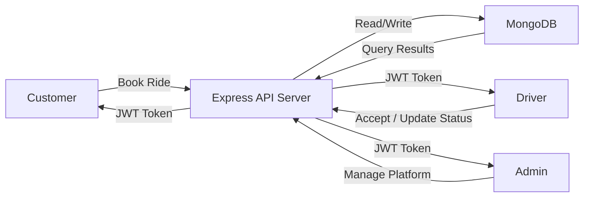
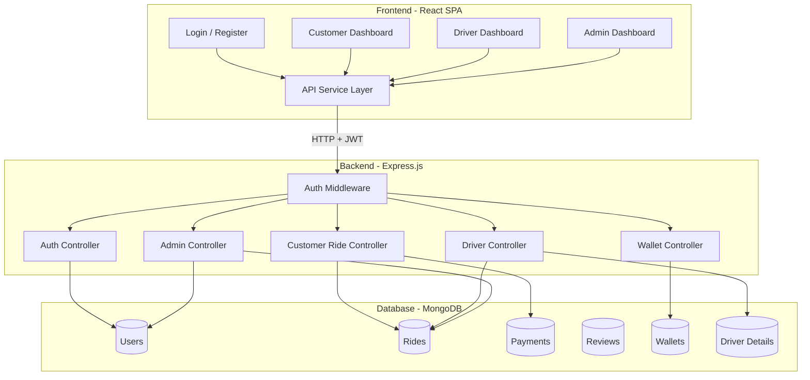
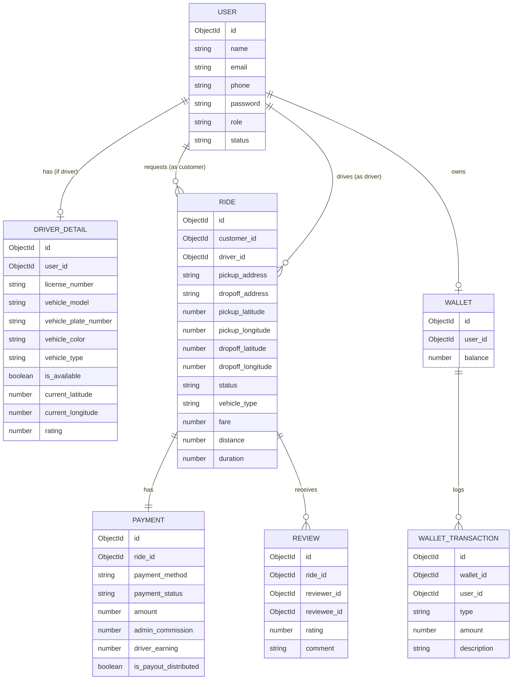
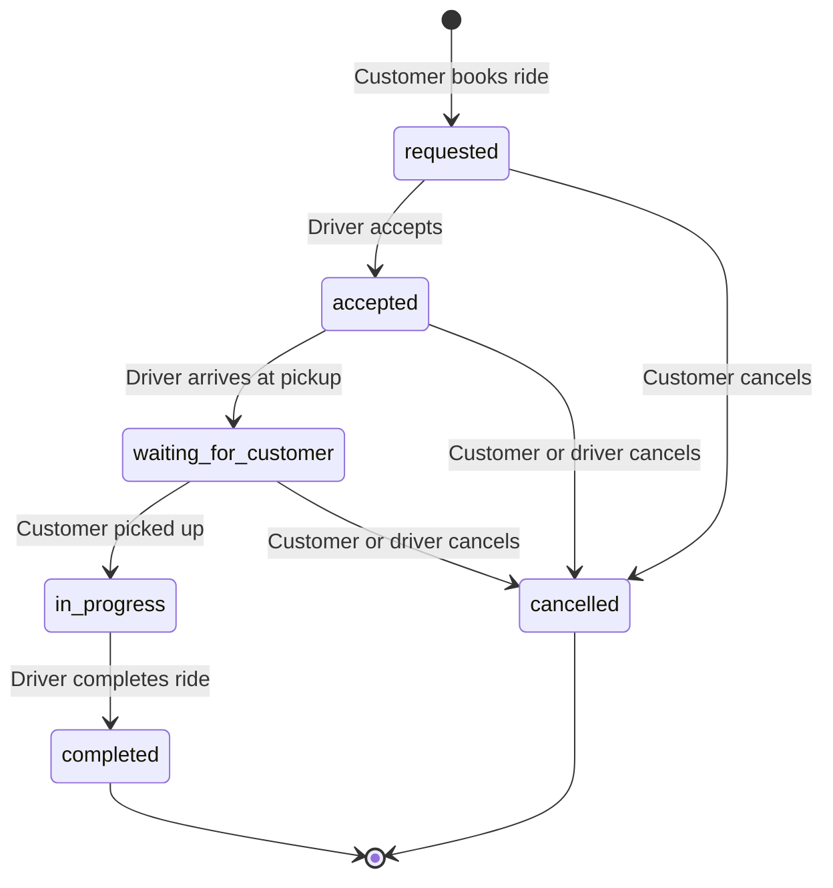
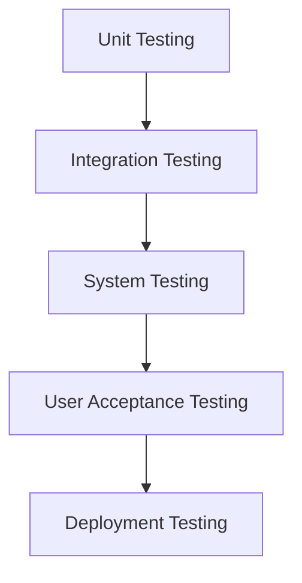

# 🚖 Indian Cabs — Cab Booking System Documentation
> **Tech Stack:** React 19 + Vite (Frontend) · Node.js + Express (Backend) · MongoDB + Mongoose (Database)

---

## Table of Contents

1. [Introduction](#1-introduction)
2. [Existing System Limitations](#2-existing-system-limitations)
3. [Objectives](#3-objectives)
4. [Scope](#4-scope)
5. [Technology Stack](#5-technology-stack)
6. [Advantages & Limitations](#6-advantages--limitations)
7. [System Design](#7-system-design)
   - [System Architecture](#71-system-architecture)
   - [Project Structure](#72-project-structure)
8. [Database Design](#8-database-design)
   - [Database Schema](#81-database-schema)
   - [ER Diagram](#82-er-diagram)
9. [Getting Started (Setup & Installation)](#9-getting-started)
10. [Environment Configuration](#10-environment-configuration)
11. [Backend API Reference](#11-backend-api-reference)
    - [Authentication](#111-authentication)
    - [Customer Endpoints](#112-customer-endpoints)
    - [Driver Endpoints](#113-driver-endpoints)
    - [Admin Endpoints](#114-admin-endpoints)
    - [Wallet Endpoints](#115-wallet-endpoints)
12. [Frontend Application](#12-frontend-application)
    - [Routing & Navigation](#121-routing--navigation)
    - [Components](#122-components)
    - [API Service Layer](#123-api-service-layer)
13. [Business Logic](#13-business-logic)
    - [Fare Calculation](#131-fare-calculation)
    - [Ride Lifecycle](#132-ride-lifecycle)
    - [Payment & Commission](#133-payment--commission)
    - [Wallet System](#134-wallet-system)
    - [Driver Matching](#135-driver-matching)
14. [Authentication & Authorization](#14-authentication--authorization)
15. [Software Testing](#15-software-testing)
    - [Testing Strategy](#151-testing-strategy)
    - [Unit Testing](#152-unit-testing)
    - [Integration Testing](#153-integration-testing)
    - [User Acceptance Testing (UAT)](#154-user-acceptance-testing-uat)
    - [Test Cases](#155-test-cases)
16. [Seed Data & Testing](#16-seed-data--testing)
17. [Deployment Scripts](#17-deployment-scripts)
18. [Error Handling](#18-error-handling)
19. [Book References](#19-book-references)

---

## 1. Introduction

**Indian Cabs** is a comprehensive, full-stack web-based cab booking system developed to address the growing demand for on-demand urban transportation services in India. The rapid growth of smartphone usage and internet connectivity has transformed how people commute, making app-based ride-hailing a fundamental part of modern urban life.

This project aims to build a scalable, modular, and secure online cab booking platform that connects **passengers (customers)** with **drivers** through a centralized web application managed by an **administrator**. The system implements the complete ride lifecycle — from ride request and driver matching to fare calculation, real-time tracking, digital wallet payments, and post-ride reviews.

The platform is architected as a modern three-tier web application:
- **Presentation Layer:** A React 19 single-page application (SPA) built with Vite and TypeScript, providing role-specific dashboards for customers, drivers, and administrators.
- **Application Layer:** A Node.js + Express RESTful API server that handles business logic, authentication, and ride orchestration.
- **Data Layer:** A MongoDB NoSQL database managed through Mongoose ODM for flexible, document-based data storage.

The system supports three distinct user roles — **Customer**, **Driver**, and **Admin** — each with a dedicated dashboard and tailored set of capabilities. Key features include multi-role authentication, real-time ride booking with live fare estimation, a digital wallet with recharge and automatic refund capabilities, a configurable commission-based payment model, and a star-rating review system.

This documentation provides a complete technical reference for the Indian Cabs platform, covering system architecture, database design, API specifications, frontend components, business logic, testing methodologies, and deployment procedures.

### Key Features

| Feature | Description |
|---|---|
| **Multi-Role Authentication** | Role-based login/registration for Customer, Driver, and Admin |
| **Real-Time Ride Booking** | Customers book rides with pickup/dropoff locations, vehicle type selection, and live fare estimation |
| **Driver Ride Management** | Drivers go online, receive nearby ride requests, accept/reject rides, and progress through ride statuses |
| **Live Ride Tracking** | Real-time status updates with animated progress bars, ETA countdowns, and waiting timers |
| **Wallet System** | Digital wallet with recharge, ride payments, and automatic refunds on cancellation |
| **Payment & Commission** | Automatic fare split between driver earnings and admin commission (configurable %) |
| **Rating & Reviews** | Post-ride driver rating system (1–5 stars) with comment support |
| **Admin Dashboard** | Platform analytics, user management, driver onboarding, and ride monitoring |
| **Vehicle Management** | Driver vehicle registration, update, and deletion (CRUD) |
| **Dark/Light Theme** | Theme toggle with system preference detection and persistence |

---

## 2. Existing System Limitations

Traditional cab booking and transportation management systems suffer from several critical limitations that motivated the development of this project:

### 2.1 Manual Booking Process
Conventional taxi services rely on phone-based or stand-based booking, which is time-consuming and error-prone. Customers have no visibility into driver availability, expected arrival time, or fare estimation before committing to a ride.

### 2.2 Lack of Fare Transparency
In traditional systems, fares are often negotiated between the customer and driver, leading to inconsistencies, overcharging, and disputes. There is no standardized, distance-based fare calculation visible to both parties before the ride begins.

### 2.3 No Real-Time Tracking
Customers have no way to track the status of their assigned driver or ride progress in real time. This leads to uncertainty, long wait times, and poor user experience.

### 2.4 Payment Difficulties
Traditional systems rely almost entirely on cash payments. There is no digital wallet, no automatic commission splitting, and no audit trail for financial transactions. This makes accounting, reconciliation, and refund processing manual and tedious.

### 2.5 No Centralized Management
Conventional taxi services lack a centralized dashboard for platform administrators. There is no easy way to monitor ride activity, manage driver rosters, suspend fraudulent accounts, or view aggregate business analytics.

### 2.6 Driver-Customer Communication Gap
Without a unified platform, drivers and customers have no standardized channel for ride coordination. Miscommunication about pickup locations, delays, and ride statuses is common.

### 2.7 No Rating or Feedback Mechanism
Traditional systems offer no structured way for customers to rate drivers or leave feedback, making it difficult to maintain service quality and hold drivers accountable.

### 2.8 Scalability Issues
Manual and phone-based booking systems cannot scale to handle high volumes of ride requests, multiple vehicle types, or multi-city operations efficiently.

---

## 3. Objectives

The primary objectives of the Indian Cabs — Cab Booking System are:

### 3.1 Primary Objectives

1. **Develop an Online Cab Booking Platform:** Design and implement a web-based application that allows customers to book cabs online with real-time fare estimation, driver matching, and ride tracking.

2. **Implement Role-Based Access Control:** Create a secure, multi-role authentication system supporting three user types — Customer, Driver, and Admin — each with distinct permissions and dedicated dashboards.

3. **Automate Fare Calculation:** Build a transparent, distance-based fare calculation engine that computes fares automatically based on vehicle type and distance traveled, eliminating manual negotiation.

4. **Enable Real-Time Ride Lifecycle Management:** Implement a complete ride lifecycle from request → acceptance → pickup → in-progress → completion/cancellation, with real-time status updates for all parties.

5. **Build a Digital Wallet System:** Develop a secure digital wallet with recharge, ride payment, and automatic refund capabilities to enable cashless transactions.

6. **Implement Driver Matching Algorithm:** Create a proximity-based driver matching system using the Haversine formula to connect customers with the nearest available drivers matching the requested vehicle type.

7. **Provide Administrative Tools:** Develop a comprehensive admin dashboard with platform analytics, user management, driver onboarding, ride monitoring, and revenue tracking.

### 3.2 Secondary Objectives

8. **Enable Post-Ride Reviews:** Implement a star-rating and comment system for customers to rate drivers, maintaining service quality standards.

9. **Support Multiple Vehicle Types:** Allow customers to choose from Car (sedan/SUV/hatchback), Bike, and Rickshaw categories with distinct fare rates.

10. **Implement Commission-Based Revenue Model:** Automate the splitting of ride fares between driver earnings and platform commission (configurable percentage).

11. **Ensure Responsive & Accessible UI:** Build a modern, responsive frontend with dark/light theme support that works across devices and screen sizes.

12. **Design for Scalability:** Use a modular architecture with clear separation of concerns (MVC pattern) to allow future enhancements, additional vehicle types, and scaling to multiple cities.

---

## 4. Scope

This section defines the boundaries of the Indian Cabs — Cab Booking System, outlining what is included and what is outside the scope of the current implementation.

### 4.1 In Scope

| Area | Details |
|---|---|
| **User Registration & Authentication** | Email-based registration and login with JWT authentication for three roles (Customer, Driver, Admin) |
| **Ride Booking** | On-demand ride booking with pickup/dropoff locations, vehicle type selection, fare estimation, and distance calculation |
| **Driver Management** | Driver registration with vehicle details, online/offline toggling, location heartbeat, and vehicle CRUD operations |
| **Ride Lifecycle** | Complete ride state management: requested → accepted → waiting → in_progress → completed/cancelled |
| **Payment Processing** | Fare calculation, wallet-based payment, cash payment tracking, automatic commission splitting, and refund processing |
| **Wallet System** | Customer wallet with recharge (min ₹1, max ₹2,000 balance), ride payment deduction, and automatic cancellation refunds |
| **Admin Dashboard** | Platform statistics, user listing with search/filter, driver suspension/activation, ride monitoring, and driver onboarding |
| **Rating System** | Post-ride star rating (1–5) with optional comments; driver rating aggregation |
| **Theme Support** | System/Light/Dark theme toggle with localStorage persistence |
| **Database** | MongoDB-based data storage with Mongoose ODM for Users, Rides, Payments, Reviews, Wallets, and Wallet Transactions |
| **Deployment** | Shell scripts for starting, stopping, and checking status of backend and frontend servers |

### 4.2 Out of Scope

The following features are **not** included in the current version but are candidates for future development:

| Area | Details |
|---|---|
| **GPS-Based Live Map Tracking** | Real-time map visualization with driver movement (requires Google Maps / Mapbox integration) |
| **Push Notifications** | Real-time push notifications via WebSockets or Firebase Cloud Messaging |
| **Actual Payment Gateway** | Integration with Razorpay, Stripe, or other payment gateways for real credit/debit card processing |
| **OTP-Based Authentication** | SMS or email-based OTP verification for registration and login |
| **Multi-City / Multi-Region** | Support for multiple cities with different fare structures and driver pools |
| **Ride Scheduling** | While the schema supports `scheduled_at`, advanced scheduling with driver pre-assignment is not fully implemented |
| **Mobile Applications** | Native iOS and Android apps (currently web-only) |
| **In-App Chat** | Real-time messaging between customer and driver |
| **Surge Pricing** | Dynamic pricing based on demand, time of day, or weather conditions |
| **Driver Document Verification** | KYC/document upload and admin verification workflow |

---

## 5. Technology Stack

### 5.1 Backend (`cab-backend-node`)

| Technology | Version | Purpose |
|---|---|---|
| **Node.js** | 18+ | Server-side JavaScript runtime built on Chrome's V8 engine |
| **Express.js** | 4.19.x | Minimal, flexible HTTP web framework for building RESTful APIs |
| **MongoDB** | 6+ | NoSQL document-oriented database for flexible schema design |
| **Mongoose** | 8.2.x | Elegant MongoDB object data modeling (ODM) for Node.js |
| **JSON Web Tokens (JWT)** | 9.0.x | Stateless token-based authentication standard (RFC 7519) |
| **bcryptjs** | 2.4.x | Password hashing using the bcrypt algorithm with salt rounds |
| **CORS** | 2.8.x | Cross-Origin Resource Sharing middleware for API security |
| **dotenv** | 16.4.x | Environment variable management from `.env` files |
| **nodemon** | 3.1.x | Development utility for automatic server restart on file changes |

### 5.2 Frontend (`cab-frontend`)

| Technology | Version | Purpose |
|---|---|---|
| **React** | 19.x | Declarative, component-based UI library for building interactive interfaces |
| **Vite** | 8.x | Next-generation frontend build tool with instant HMR (Hot Module Replacement) |
| **TypeScript** | 6.x | Statically typed superset of JavaScript for type safety and better tooling |
| **React Router DOM** | 7.x | Declarative client-side routing and navigation for SPAs |
| **TailwindCSS** | 4.x | Utility-first CSS framework for rapid UI styling |
| **Lucide React** | 1.x | Modern, customizable icon library based on Feather Icons |

### 5.3 Alternative Backend (`cab-backend-php`)

| Technology | Version | Purpose |
|---|---|---|
| **PHP** | 8.2+ | Server-side scripting language |
| **Laravel** | 11.x | Full-featured MVC web application framework |
| **MySQL** | 8.0+ | Relational database management system |
| **Laravel Sanctum** | — | Lightweight API token authentication |
| **Eloquent ORM** | — | Active Record-based database abstraction layer |

### 5.4 Development & DevOps Tools

| Tool | Purpose |
|---|---|
| **Git** | Version control system |
| **npm** | Node.js package manager |
| **Composer** | PHP dependency manager (for Laravel backend) |
| **Shell Scripts** | Automated start/stop/status management for servers |
| **MongoDB Compass** | GUI tool for MongoDB database inspection |
| **VS Code** | Recommended code editor with extensions |

---

## 6. Advantages & Limitations

### 6.1 Advantages

| # | Advantage | Description |
|---|---|---|
| 1 | **User-Friendly Interface** | Modern, responsive UI with dark/light theme support provides an intuitive experience across all user roles |
| 2 | **Real-Time Status Updates** | Automated polling and status progression keep all parties informed about ride state changes in real time |
| 3 | **Transparent Fare System** | Distance-based, rate-configurable fare calculation eliminates ambiguity and ensures fair pricing for customers |
| 4 | **Secure Authentication** | JWT-based stateless authentication with bcrypt password hashing ensures data security and session integrity |
| 5 | **Digital Wallet** | Built-in wallet system with recharge, automatic deduction, and refund capabilities enables seamless cashless transactions |
| 6 | **Automated Commission Split** | Platform automatically distributes ride earnings between drivers and admin, reducing manual accounting work |
| 7 | **Modular Architecture** | Clear separation of concerns (controllers, models, middleware, services) makes the codebase maintainable and extensible |
| 8 | **Role-Based Access Control** | Strict role enforcement ensures that customers, drivers, and admins can only access features relevant to their role |
| 9 | **Multiple Vehicle Support** | Support for Car, Bike, and Rickshaw with distinct fare rates provides flexibility for diverse transportation needs |
| 10 | **Admin Analytics** | Comprehensive dashboard with real-time statistics empowers administrators to make data-driven decisions |
| 11 | **Dual Backend Support** | Availability of both Node.js and PHP (Laravel) backends provides deployment flexibility |
| 12 | **Rating System** | Post-ride rating mechanism encourages quality service and accountability among drivers |

### 6.2 Limitations

| # | Limitation | Description |
|---|---|---|
| 1 | **No Live Map Integration** | The system does not include real-time map visualization with GPS-based driver tracking; locations are text-based |
| 2 | **No Push Notifications** | Real-time updates rely on polling (HTTP requests at intervals) rather than WebSocket push notifications |
| 3 | **Simulated Payment** | No actual payment gateway (Razorpay, Stripe) integration; wallet transactions are simulated within the system |
| 4 | **Web-Only Platform** | No native mobile applications for iOS or Android; the system is accessible only through web browsers |
| 5 | **No OTP Verification** | User registration does not include phone/email OTP verification, relying solely on email-password credentials |
| 6 | **Single-City Design** | The current implementation does not support multi-city operations with separate fare structures or driver pools |
| 7 | **No Surge Pricing** | Fare rates are static and configurable only through environment variables; dynamic demand-based pricing is not supported |
| 8 | **Limited Ride Scheduling** | While the database schema supports scheduling, advanced future ride scheduling with driver pre-assignment is not fully implemented |
| 9 | **No Document Verification** | Driver onboarding does not include KYC, license upload, or document verification workflows |
| 10 | **Polling-Based Updates** | Frontend uses interval-based HTTP polling (every 2–5 seconds) instead of efficient WebSocket connections, which may increase server load |

---

## 7. System Design

### 7.1 System Architecture

```
┌─────────────────────────────────────────────────────────────────┐
│                        CLIENT BROWSER                          │
│  ┌───────────────────────────────────────────────────────────┐  │
│  │           React 19 + Vite Frontend (Port 5173)            │  │
│  │  ┌──────────┐ ┌──────────┐ ┌──────────┐ ┌─────────────┐  │  │
│  │  │  Login   │ │ Customer │ │  Driver  │ │   Admin     │  │  │
│  │  │ Register │ │Dashboard │ │Dashboard │ │ Dashboard   │  │  │
│  │  └──────────┘ └──────────┘ └──────────┘ └─────────────┘  │  │
│  │                      │                                     │  │
│  │              ┌───────┴───────┐                             │  │
│  │              │  API Service  │ (api.ts)                    │  │
│  │              │  fetch + JWT  │                             │  │
│  │              └───────┬───────┘                             │  │
│  └──────────────────────│────────────────────────────────────┘  │
└─────────────────────────│──────────────────────────────────────┘
                          │ HTTP REST (JSON)
                          ▼
┌─────────────────────────────────────────────────────────────────┐
│              Node.js + Express Backend (Port 8000)              │
│  ┌──────────────────────────────────────────────────────────┐   │
│  │                     Middleware Layer                      │   │
│  │  ┌────────┐  ┌──────────────┐  ┌──────────────────────┐  │   │
│  │  │  CORS  │  │  express.json │  │  Auth (JWT Verify)  │  │   │
│  │  └────────┘  └──────────────┘  └──────────────────────┘  │   │
│  ├──────────────────────────────────────────────────────────┤   │
│  │                    Controllers Layer                      │   │
│  │  ┌──────────┐ ┌────────────────┐ ┌──────────────────┐    │   │
│  │  │   Auth   │ │ CustomerRide   │ │     Driver       │    │   │
│  │  │Controller│ │  Controller    │ │   Controller     │    │   │
│  │  └──────────┘ └────────────────┘ └──────────────────┘    │   │
│  │  ┌──────────┐ ┌────────────────┐                         │   │
│  │  │  Admin   │ │    Wallet      │                         │   │
│  │  │Controller│ │  Controller    │                         │   │
│  │  └──────────┘ └────────────────┘                         │   │
│  ├──────────────────────────────────────────────────────────┤   │
│  │                      Models Layer (Mongoose)              │   │
│  │  User · Ride · DriverDetail · Payment · Review ·          │   │
│  │  Wallet · WalletTransaction                               │   │
│  └──────────────────────────────────────────────────────────┘   │
└────────────────────────────┬────────────────────────────────────┘
                             │ MongoDB Protocol
                             ▼
                  ┌─────────────────────┐
                  │   MongoDB (27017)   │
                  │   Database:         │
                  │   cab_booking       │
                  └─────────────────────┘
```

---

### 7.2 Data Flow Diagram



### 7.3 Module Interaction Diagram



### 7.4 Project Structure

```
cab-booking/
├── cab-backend-node/           # Backend API server
│   ├── controllers/
│   │   ├── authController.js         # Register, Login, Logout, Me
│   │   ├── customerRideController.js # Ride CRUD, nearby drivers, rating
│   │   ├── driverController.js       # Location, ride lifecycle, vehicle CRUD
│   │   ├── adminController.js        # Dashboard stats, user & ride management
│   │   └── walletController.js       # Wallet balance & recharge
│   ├── middleware/
│   │   └── auth.js                   # JWT authentication & role restriction
│   ├── models/
│   │   ├── User.js                   # User schema (customer/driver/admin)
│   │   ├── Ride.js                   # Ride booking schema
│   │   ├── DriverDetail.js           # Vehicle & location details
│   │   ├── Payment.js                # Payment & commission tracking
│   │   ├── Review.js                 # Post-ride rating/review
│   │   ├── Wallet.js                 # User wallet balance
│   │   └── WalletTransaction.js      # Wallet transaction log
│   ├── server.js                     # Express app entry point & route definitions
│   ├── seed.js                       # Database seeder script
│   ├── .env                          # Environment configuration
│   └── package.json
│
├── cab-frontend/               # React frontend application
│   ├── src/
│   │   ├── components/
│   │   │   ├── Login.tsx             # Role-based login page
│   │   │   ├── Register.tsx          # Multi-step registration (account + vehicle)
│   │   │   ├── CustomerDashboard.tsx # Customer booking & ride tracking UI
│   │   │   ├── DriverDashboard.tsx   # Driver ride management UI
│   │   │   ├── AdminDashboard.tsx    # Admin analytics & management panel
│   │   │   ├── Dashboard.tsx         # Generic dashboard wrapper
│   │   │   └── ThemeToggle.tsx       # Dark/Light theme switcher
│   │   ├── services/
│   │   │   └── api.ts                # API client with JWT injection & fare calculator
│   │   ├── App.tsx                   # Router & route guards
│   │   ├── App.css                   # Global styles
│   │   ├── index.css                 # Root styles
│   │   └── main.tsx                  # React entry point
│   ├── vite.config.ts                # Vite build configuration
│   └── package.json
│
├── start.sh                    # Starts both backend & frontend servers
├── stop.sh                     # Stops both servers
├── status.sh                   # Checks server status
└── test.sh                     # Test runner
```

---

## 8. Database Design

The Indian Cabs system uses **MongoDB**, a document-oriented NoSQL database, for data persistence. The database is named `cab_booking` and consists of seven primary collections. The schema is managed through **Mongoose ODM**, which provides schema validation, virtual fields, instance methods, and pre/post hooks.

### Design Rationale

- **NoSQL (MongoDB)** was chosen over relational databases for its flexible schema design, native JSON document storage (ideal for JavaScript/Node.js stack), horizontal scalability, and ease of embedding related data.
- **Mongoose ODM** provides schema-level validation, virtual relationships, middleware hooks, and a clean API for database operations.
- **Referential relationships** (via `ObjectId` references) are used instead of embedding to maintain data normalization and avoid duplication for entities like Users, Rides, and Payments.

### 8.1 Database Schema

---

## 9. Getting Started

### Prerequisites

- **Node.js** v18 or later
- **npm** v9 or later
- **MongoDB** v6+ (running on `localhost:27017`)

### Installation Steps

```bash
# 1. Clone the repository
git clone <repository-url>
cd cab-booking

# 2. Install backend dependencies
cd cab-backend-node
npm install

# 3. Install frontend dependencies
cd ../cab-frontend
npm install

# 4. Return to project root
cd ..
```

### Running the Application

#### Option A: Using the startup script (recommended)

```bash
# Start both servers simultaneously
./start.sh

# The script will:
# - Kill any processes on ports 8000 & 5173
# - Start MongoDB if not running (via Homebrew)
# - Launch the Node.js backend on port 8000
# - Launch the Vite frontend on port 5173
```

#### Option B: Manual startup

```bash
# Terminal 1 — Backend
cd cab-backend-node
npm run dev        # Starts with nodemon (auto-reload)

# Terminal 2 — Frontend
cd cab-frontend
npm run dev        # Starts Vite dev server
```

### Seeding the Database

```bash
cd cab-backend-node
npm run seed       # or: node seed.js
```

This creates three test accounts:

| Role | Email | Password |
|---|---|---|
| Customer | `customer@cab.com` | `password123` |
| Driver | `driver@cab.com` | `password123` |
| Admin | `admin@cab.com` | `password123` |

### Access URLs

| Service | URL |
|---|---|
| Frontend | http://localhost:5173 |
| Backend API | http://localhost:8000/api |

---

## 10. Environment Configuration

Backend environment variables are defined in `cab-backend-node/.env`:

| Variable | Default | Description |
|---|---|---|
| `PORT` | `8000` | Express server port |
| `MONGODB_URI` | `mongodb://127.0.0.1:27017/cab_booking` | MongoDB connection string |
| `JWT_SECRET` | `cab_booking_jwt_secret_key_12345!` | Secret key for signing JWTs |
| `COMMISSION_PERCENTAGE` | `10` | Admin commission on each ride (%) |
| `VEHICLE_RATE_CAR` | `30` | Fare rate per km for Car (₹) |
| `VEHICLE_RATE_BIKE` | `10` | Fare rate per km for Bike (₹) |
| `VEHICLE_RATE_RICKSHAW` | `20` | Fare rate per km for Rickshaw (₹) |

Frontend environment variable (optional, defined in Vite):

| Variable | Default | Description |
|---|---|---|
| `VITE_API_URL` | `http://<hostname>:8000/api` | Backend API base URL (auto-detected) |

---

#### 8.1.1 User Collection

**Collection Name:** `users`

| Field | Type | Constraints | Description |
|---|---|---|---|
| `name` | String | Required, trimmed | Full name |
| `email` | String | Required, unique, lowercase | Login email |
| `phone` | String | Required, unique | Phone number |
| `password` | String | Required, bcrypt hashed | Hashed password (auto-hashed via pre-save hook) |
| `role` | String | Enum: `customer`, `driver`, `admin` | User role |
| `status` | String | Enum: `active`, `suspended` | Account status |
| `createdAt` | Date | Auto-generated | Timestamp |
| `updatedAt` | Date | Auto-generated | Timestamp |

**Virtuals:** `driver_detail` → references `DriverDetail` (populated via `user_id`)

**Hooks:**
- `pre('save')`: Automatically hashes password with bcrypt (salt rounds: 10)

**Instance Methods:**
- `comparePassword(candidatePassword)`: Compares plain-text password against stored hash

---

#### 8.1.2 Ride Collection

**Collection Name:** `rides`

| Field | Type | Constraints | Description |
|---|---|---|---|
| `customer_id` | ObjectId (ref: User) | Required | Customer who requested the ride |
| `driver_id` | ObjectId (ref: User) | Nullable | Assigned driver |
| `pickup_address` | String | Required | Human-readable pickup location |
| `dropoff_address` | String | Required | Human-readable dropoff location |
| `pickup_latitude` | Number | Required | Pickup GPS latitude |
| `pickup_longitude` | Number | Required | Pickup GPS longitude |
| `dropoff_latitude` | Number | Required | Dropoff GPS latitude |
| `dropoff_longitude` | Number | Required | Dropoff GPS longitude |
| `status` | String | Enum (see Ride Lifecycle) | Current ride state |
| `pickup_waiting_started_at` | Date | Nullable | When driver arrived and started waiting |
| `driver_accepted_at` | Date | Nullable | When driver accepted the ride |
| `estimated_pickup_at` | Date | Nullable | Estimated arrival time at pickup |
| `vehicle_type` | String | Default: `Car` | Vehicle type: `Car`, `Bike`, `Rickshaw` |
| `fare` | Number | Required | Calculated fare amount (₹) |
| `distance` | Number | Required | Trip distance in km |
| `duration` | Number | Required | Estimated/actual duration in minutes |
| `scheduled_at` | Date | Nullable | For future ride scheduling |

**Virtuals:** `customer`, `driver`, `payment`, `reviews`

---

#### 8.1.3 DriverDetail Collection

**Collection Name:** `driverdetails`

| Field | Type | Constraints | Description |
|---|---|---|---|
| `user_id` | ObjectId (ref: User) | Required | Associated driver user |
| `license_number` | String | Required, unique | Driving license number |
| `vehicle_model` | String | Required | Vehicle make/model |
| `vehicle_plate_number` | String | Required, unique | Registration plate |
| `vehicle_color` | String | Required | Vehicle color |
| `vehicle_type` | String | Enum: `sedan`, `suv`, `hatchback`, `bike`, `rickshaw` | Vehicle category |
| `is_available` | Boolean | Default: `false` | Online/available status |
| `current_latitude` | Number | Default: `12.9716` (Bangalore) | Current GPS latitude |
| `current_longitude` | Number | Default: `77.5946` (Bangalore) | Current GPS longitude |
| `rating` | Number | Default: `5.0` | Average driver rating |

**Virtuals:** `user`, `reviews_count`

---

#### 8.1.4 Payment Collection

**Collection Name:** `payments`

| Field | Type | Constraints | Description |
|---|---|---|---|
| `ride_id` | ObjectId (ref: Ride) | Required | Associated ride |
| `payment_method` | String | Enum: `cash`, `card`, `wallet` | Payment type |
| `payment_status` | String | Enum: `pending`, `completed`, `failed`, `refunded` | Transaction status |
| `amount` | Number | Required | Total fare amount |
| `admin_commission` | Number | Required | Platform commission portion |
| `driver_earning` | Number | Required | Driver's earning after commission |
| `is_payout_distributed` | Boolean | Default: `false` | Whether earnings have been deposited |
| `transaction_reference` | String | Nullable | External transaction ID |

---

#### 8.1.5 Review Collection

**Collection Name:** `reviews`

| Field | Type | Constraints | Description |
|---|---|---|---|
| `ride_id` | ObjectId (ref: Ride) | Required | Reviewed ride |
| `reviewer_id` | ObjectId (ref: User) | Required | Customer who left the review |
| `reviewee_id` | ObjectId (ref: User) | Required | Driver being reviewed |
| `rating` | Number | Required, 1–5 | Star rating |
| `comment` | String | Nullable | Optional text comment |

---

#### 8.1.6 Wallet Collection

**Collection Name:** `wallets`

| Field | Type | Constraints | Description |
|---|---|---|---|
| `user_id` | ObjectId (ref: User) | Required, unique | Wallet owner |
| `balance` | Number | Default: `0.00` | Current balance (₹) |

---

#### 8.1.7 WalletTransaction Collection

**Collection Name:** `wallettransactions`

| Field | Type | Constraints | Description |
|---|---|---|---|
| `wallet_id` | ObjectId (ref: Wallet) | Required | Associated wallet |
| `user_id` | ObjectId (ref: User) | Required | Transaction owner |
| `type` | String | Enum: `deposit`, `payment`, `refund` | Transaction type |
| `amount` | Number | Required | Transaction amount |
| `description` | String | Required | Human-readable description |
| `reference_id` | String | Nullable | Reference to ride or external ID |

---

### 8.2 ER Diagram (Entity Relationship Diagram)

The following ER diagram illustrates the relationships between all entities in the Indian Cabs database:



### 8.3 Data Dictionary Summary

| Collection | Fields | Primary Key | Foreign Keys | Purpose |
|---|---|---|---|---|
| `users` | 7 | `_id` | — | Stores all user accounts (customers, drivers, admins) |
| `rides` | 15+ | `_id` | `customer_id`, `driver_id` → `users` | Tracks all ride bookings and their lifecycle |
| `driverdetails` | 10 | `_id` | `user_id` → `users` | Stores driver-specific vehicle and location data |
| `payments` | 8 | `_id` | `ride_id` → `rides` | Records payment details and commission splits |
| `reviews` | 5 | `_id` | `ride_id` → `rides`, `reviewer_id` / `reviewee_id` → `users` | Post-ride ratings and comments |
| `wallets` | 2 | `_id` | `user_id` → `users` | User wallet balances |
| `wallettransactions` | 6 | `_id` | `wallet_id` → `wallets`, `user_id` → `users` | Wallet transaction audit log |


---

## 11. Backend API Reference

**Base URL:** `http://localhost:8000/api`

All authenticated endpoints require the header:
```
Authorization: Bearer <jwt_token>
```

### 11.1 Authentication

#### `POST /api/register` — Register New User

**Access:** Public

**Request Body:**

```json
{
  "name": "John Doe",
  "email": "john@example.com",
  "phone": "9876543210",
  "password": "password123",
  "role": "customer"
}
```

For driver registration with vehicle details:
```json
{
  "name": "Dave Driver",
  "email": "dave@example.com",
  "phone": "1234567890",
  "password": "password123",
  "role": "driver",
  "license_number": "DL-12345",
  "vehicle_model": "Toyota Camry",
  "vehicle_plate_number": "MH12AB1234",
  "vehicle_color": "White",
  "vehicle_type": "sedan"
}
```

**Success Response (201):**
```json
{
  "user": { "id": "...", "name": "John Doe", "email": "john@example.com", "role": "customer" },
  "access_token": "<jwt_token>",
  "token_type": "Bearer"
}
```

**Validation Error (422):**
```json
{
  "message": "The given data was invalid.",
  "errors": {
    "email": ["The email has already been taken."]
  }
}
```

---

#### `POST /api/login` — User Login

**Access:** Public

**Request Body:**
```json
{
  "email": "customer@cab.com",
  "password": "password123"
}
```

**Success Response (200):**
```json
{
  "user": { "id": "...", "name": "John Customer", "email": "customer@cab.com", "role": "customer" },
  "access_token": "<jwt_token>",
  "token_type": "Bearer"
}
```

**Suspended Account (403):**
```json
{
  "message": "Your account has been suspended by an administrator."
}
```

---

#### `POST /api/logout` — Logout

**Access:** Authenticated

**Response (200):**
```json
{
  "message": "Logged out successfully."
}
```

> **Note:** JWT is stateless — the client is responsible for deleting the stored token.

---

#### `GET /api/me` — Get Current User Profile

**Access:** Authenticated

**Response (200):**
```json
{
  "user": {
    "id": "...",
    "name": "John Customer",
    "email": "john@example.com",
    "phone": "9876543210",
    "role": "customer",
    "status": "active",
    "driver_detail": null
  }
}
```

---

### 11.2 Customer Endpoints

> All customer endpoints require authentication with a `customer` role.

#### `GET /api/customer/drivers/nearby` — Find Nearby Drivers

**Query Parameters:**

| Param | Type | Required | Default | Description |
|---|---|---|---|---|
| `latitude` | Number | Yes | — | Customer's current latitude |
| `longitude` | Number | Yes | — | Customer's current longitude |
| `radius` | Number | No | `10` | Search radius in km |

**Response (200):**
```json
{
  "drivers": [
    {
      "id": "...",
      "user_id": "...",
      "vehicle_model": "Toyota Camry",
      "vehicle_type": "sedan",
      "vehicle_color": "White",
      "is_available": true,
      "rating": 4.9,
      "distance": 2.35,
      "user": { "id": "...", "name": "Dave Driver", "phone": "..." }
    }
  ]
}
```

---

#### `POST /api/customer/rides` — Book a Ride

**Request Body:**

| Field | Type | Required | Description |
|---|---|---|---|
| `pickup_address` | String | Yes | Pickup location name |
| `dropoff_address` | String | Yes | Dropoff location name |
| `pickup_latitude` | Number | Yes | Pickup GPS latitude |
| `pickup_longitude` | Number | Yes | Pickup GPS longitude |
| `dropoff_latitude` | Number | Yes | Dropoff GPS latitude |
| `dropoff_longitude` | Number | Yes | Dropoff GPS longitude |
| `distance` | Number | Yes | Distance in km |
| `vehicle_type` | String | No | `car`, `bike`, or `rickshaw` (default: `car`) |
| `payment_method` | String | No | `cash`, `card`, or `wallet` (default: `cash`) |
| `scheduled_at` | Date | No | Schedule for future pickup |

**Response (201):**
```json
{
  "message": "Ride requested successfully. Searching for nearby drivers...",
  "ride": {
    "id": "...",
    "status": "requested",
    "fare": 150.00,
    "distance": 5.0,
    "duration": 10,
    "vehicle_type": "Car",
    "payment": { "..." : "..." }
  }
}
```

**No Drivers Available (422):**
```json
{
  "message": "Driver is not available. No Car drivers are currently active. Currently available: Bike, Rickshaw.",
  "errors": { "vehicle_type": ["..."] }
}
```

---

#### `GET /api/customer/rides` — List Customer's Rides (Paginated)

**Query Parameters:**

| Param | Type | Default | Description |
|---|---|---|---|
| `page` | Number | `1` | Page number |

**Response (200):**
```json
{
  "current_page": 1,
  "data": [ { "id": "...", "status": "completed", "fare": 150 } ],
  "total": 25,
  "per_page": 15,
  "last_page": 2
}
```

---

#### `GET /api/customer/rides/:id` — Get Ride Details

**Response (200):** Full ride object with populated `driver`, `payment`, and `reviews`.

---

#### `POST /api/customer/rides/:id/cancel` — Cancel a Ride

**Cancellable Statuses:** `requested`, `accepted`, `waiting_for_customer`

**Response (200):**
```json
{
  "message": "Ride cancelled successfully.",
  "ride": { "..." : "..." }
}
```

**Side Effects:**
- If payment was via wallet → automatic refund + `refund` wallet transaction
- Driver marked as available again

---

#### `POST /api/customer/rides/:id/rate` — Rate a Completed Ride

**Request Body:**
```json
{
  "rating": 5,
  "comment": "Excellent service!"
}
```

**Constraints:**
- Ride must be `completed`
- Driver must be assigned
- Only one review per ride

**Response (201):**
```json
{
  "message": "Review submitted successfully.",
  "review": { "id": "...", "rating": 5, "comment": "Excellent service!" }
}
```

---

### 11.3 Driver Endpoints

> All driver endpoints require authentication with a `driver` role.

#### `POST /api/driver/location` — Update Location & Availability

**Request Body:**
```json
{
  "latitude": 12.9716,
  "longitude": 77.5946,
  "is_available": true
}
```

**Response (200):**
```json
{
  "message": "Location and availability updated successfully.",
  "driver_detail": { "..." : "..." }
}
```

---

#### `GET /api/driver/rides/requests` — Get Nearby Ride Requests

Returns ride requests within 15 km that match the driver's vehicle type.

**Vehicle Type Matching:**

| Driver Vehicle Type | Matches Ride Type |
|---|---|
| `sedan`, `suv`, `hatchback` | `Car` |
| `bike` | `Bike` |
| `rickshaw` | `Rickshaw` |

**Response (200):**
```json
{
  "requests": [
    {
      "id": "...",
      "pickup_address": "MG Road",
      "dropoff_address": "Indiranagar",
      "fare": 120.00,
      "distance": 4.0,
      "driver_distance_to_pickup": 1.2,
      "customer": { "name": "John", "phone": "..." }
    }
  ]
}
```

---

#### `POST /api/driver/rides/:id/accept` — Accept a Ride Request

**Behavior:**
- Atomic update (prevents duplicate acceptance)
- Verifies vehicle type compatibility
- Sets `driver_accepted_at` and `estimated_pickup_at` (1–3 min random ETA)
- Marks driver as unavailable

**Response (200):**
```json
{
  "message": "Ride request accepted successfully.",
  "ride": { "..." : "..." }
}
```

---

#### `POST /api/driver/rides/:id/status` — Update Ride Status

**Request Body:**
```json
{
  "status": "waiting_for_customer"
}
```

**Allowed Status Progression:**

| Current Status | Allowed Next Status |
|---|---|
| `accepted` | `waiting_for_customer` |
| `waiting_for_customer` | `in_progress` |
| `in_progress` | `completed` |

**On Completion:**
- Driver marked available
- Payment status set to `completed`
- Driver earnings deposited to wallet
- Admin commission deposited to admin wallet
- Wallet transactions created for both

---

#### `POST /api/driver/rides/:id/cancel` — Cancel a Ride (by Driver)

**Response (200):**
```json
{
  "message": "Ride cancelled successfully.",
  "ride": { "..." : "..." }
}
```

---

#### `GET /api/driver/rides` — Driver Ride History (Paginated)

Same pagination format as customer rides.

---

#### `POST /api/driver/vehicle` — Register Vehicle

**Request Body:**
```json
{
  "license_number": "DL-12345",
  "vehicle_model": "Toyota Camry",
  "vehicle_plate_number": "MH12AB1234",
  "vehicle_color": "White",
  "vehicle_type": "sedan"
}
```

**Vehicle Types:** `sedan`, `suv`, `hatchback`, `bike`, `rickshaw`

---

#### `PUT /api/driver/vehicle` — Update Vehicle Details

Same body as registration. Validates unique constraints (excluding current record).

---

#### `DELETE /api/driver/vehicle` — Delete Vehicle

Removes the driver's vehicle registration from the system.

---

### 11.4 Admin Endpoints

> All admin endpoints require authentication with an `admin` role.

#### `GET /api/admin/dashboard` — Dashboard Statistics

**Response (200):**
```json
{
  "stats": {
    "total_earnings": 5420.50,
    "total_completed_rides": 182,
    "total_users": 45,
    "active_drivers_online": 8
  }
}
```

> **Note:** `active_drivers_online` counts only non-suspended drivers whose location was updated within the last 20 seconds (heartbeat-based).

---

#### `GET /api/admin/users` — List Users (Paginated)

**Query Parameters:**

| Param | Type | Description |
|---|---|---|
| `role` | String | Filter by role: `customer`, `driver`, `admin` |
| `status` | String | Filter by status: `active`, `suspended` |
| `search` | String | Search by name, email, or phone (regex) |
| `page` | Number | Page number |

---

#### `PATCH /api/admin/users/:id/status` — Suspend/Activate User

**Request Body:**
```json
{
  "status": "suspended"
}
```

**Constraints:** Cannot modify own account status.

---

#### `DELETE /api/admin/users/:id` — Delete a Driver

**Constraints:**
- Target must have `driver` role
- Cannot delete self
- Cannot delete driver with an active ride (accepted/arrived/waiting/in_progress)

**Side Effects:** Deletes associated `DriverDetail` record.

---

#### `GET /api/admin/rides` — List All Rides (Paginated)

**Query Parameters:**

| Param | Type | Description |
|---|---|---|
| `status` | String | Filter by ride status |
| `driver_id` | ObjectId | Filter by driver |
| `customer_id` | ObjectId | Filter by customer |
| `page` | Number | Page number |

---

### 11.5 Wallet Endpoints

> Available to authenticated `customer` users.

#### `GET /api/customer/wallet` — Get Wallet Balance & Transactions

**Response (200):**
```json
{
  "balance": 500.00,
  "transactions": [
    {
      "id": "...",
      "type": "deposit",
      "amount": 500,
      "description": "Wallet Recharge Deposit",
      "createdAt": "2026-09-08T..."
    }
  ]
}
```

---

#### `POST /api/customer/wallet/recharge` — Recharge Wallet

**Request Body:**
```json
{
  "amount": 500
}
```

**Constraints:**
- Minimum: ₹1
- Maximum wallet balance: ₹2,000

**Response (200):**
```json
{
  "message": "Successfully recharged ₹500.00 to your wallet!",
  "balance": 500.00,
  "transaction": { "..." : "..." },
  "transactions": []
}
```

---

## 12. Frontend Application

### 12.1 Routing & Navigation

| Path | Component | Access | Description |
|---|---|---|---|
| `/login` | `Login` | Public | Role-tabbed login page |
| `/register` | `Register` | Public | Multi-step registration |
| `/customer` | `CustomerDashboard` | Customer only | Ride booking & tracking |
| `/driver` | `DriverDashboard` | Driver only | Ride management |
| `/admin` | `AdminDashboard` | Admin only | Platform management |
| `*` | Redirect to `/login` | — | Catch-all redirect |

**Route Protection:** Uses `RoleProtectedRoute` component that checks:
1. Role-specific auth token exists in `localStorage`
2. Stored user's role matches the allowed role

**Token Storage Convention:**
- `{role}_auth_token` — JWT token
- `{role}_auth_user` — Serialized user JSON

This pattern allows **simultaneous sessions** for different roles in the same browser.

---

### 12.2 Components

#### `Login.tsx`
- **Role Tab Selector:** Customer / Driver / Admin tabs with visual differentiation
- **Form Fields:** Email, Password (with show/hide toggle)
- **Validation:** Role verification post-login (prevents cross-role access)
- **Theme:** Dark mode with glassmorphism design, decorative gradient orbs
- **Navigation:** Links to registration page (for customer/driver)

#### `Register.tsx`
- **Multi-Step Flow:**
  - **Step 1 (Account):** Name, Email, Phone, Password, Confirm Password
  - **Step 2 (Vehicle — drivers only):** License Number, Vehicle Model, Plate Number, Color, Vehicle Type dropdown
- **Skip Option:** Drivers can skip vehicle registration and add later
- **Post-Registration:** Automatically logs in and navigates to role-specific dashboard

#### `CustomerDashboard.tsx`
- **Ride Booking Panel:** Pickup/Dropoff input, vehicle type selector (Car/Bike/Rickshaw), live fare preview, distance calculation
- **Active Ride Tracking:** Real-time status updates with animated progress bar, ETA countdown, waiting timer
- **Ride History:** Paginated list with status filters (All/Completed/Cancelled)
- **Wallet Section:** Balance display, recharge modal with preset amounts, transaction history
- **Rating Modal:** Post-ride star rating with comment
- **Profile Modal:** User information display
- **Auto-Polling:** Refreshes ride status at regular intervals

#### `DriverDashboard.tsx`
- **Online/Offline Toggle:** Controls driver availability
- **Location Heartbeat:** Periodic GPS location updates to backend (every few seconds)
- **Incoming Ride Requests:** Card with countdown timer (8 seconds), pickup distance, fare preview
- **Active Trip Management:** Step-by-step status progression buttons:
  - `Arrived at Pickup` → `Start Ride` → `Complete Ride`
- **Trip Summary:** Post-completion earnings display
- **Ride History:** Paginated completed/cancelled ride list
- **Vehicle Management:** Register/edit/delete vehicle details
- **Earnings & Rating Display:** Real-time stats

#### `AdminDashboard.tsx`
- **Statistics Cards:** Total Earnings, Completed Rides, Total Users, Active Drivers Online
- **Driver Roster:** List of all drivers with status badges, suspend/activate actions, delete capability
- **Active Bookings:** Real-time view of in-progress rides
- **Ride History:** Filterable paginated list of all rides
- **Add Driver Modal:** Direct driver registration form (account + vehicle in one step)
- **Auto-Refresh:** All data refreshes every 2 seconds

#### `ThemeToggle.tsx`
- **Modes:** System / Light / Dark
- **Persistence:** Saves preference to `localStorage`
- **Detection:** Respects `prefers-color-scheme` media query

---

### 12.3 API Service Layer

The `api.ts` service provides:

#### `apiRequest(endpoint, options)`
- Auto-detects active role from URL path and injects the correct JWT
- Sets `Content-Type: application/json` and `Accept: application/json` headers
- Handles 401 responses by clearing stored tokens
- Extracts and throws human-readable validation error messages

#### `calculateFare(vehicleType, distance, pickup, dropoff)`
- Client-side fare estimation matching backend logic
- Rate table: Car = ₹30/km, Bike = ₹10/km, Rickshaw = ₹20/km
- Returns `0` if pickup/dropoff are empty or distance is invalid

---

## 13. Business Logic

### 13.1 Fare Calculation

```
fare = distance (km) × rate per km
```

| Vehicle Type | Rate (₹/km) | Env Variable |
|---|---|---|
| Car (sedan/suv/hatchback) | 30 | `VEHICLE_RATE_CAR` |
| Bike | 10 | `VEHICLE_RATE_BIKE` |
| Rickshaw | 20 | `VEHICLE_RATE_RICKSHAW` |

**Duration Estimation:**
```
duration (minutes) = ceil((distance / 30 km/h) × 60)
```

---

### 13.2 Ride Lifecycle



| Status | Description | Triggered By |
|---|---|---|
| `requested` | Ride booked, searching for drivers | Customer |
| `accepted` | Driver has accepted the ride request | Driver |
| `waiting_for_customer` | Driver arrived at pickup point | Driver |
| `in_progress` | Ride is in progress (customer picked up) | Driver |
| `completed` | Ride finished, payment processed | Driver |
| `cancelled` | Ride cancelled before completion | Customer or Driver |

---

### 13.3 Payment & Commission

When a ride is completed:

```
admin_commission = fare × (10/ 100)
driver_earning   = fare - admin_commission
```

**Payment Flow:**
1. Payment record created when ride is booked (status: `pending`)
2. If wallet payment → amount deducted immediately, status set to `completed`
3. On ride completion → payment marked `completed`, `is_payout_distributed` set to `true`
4. Driver wallet credited with `driver_earning`
5. Admin wallet credited with `admin_commission`
6. Wallet transactions recorded for audit trail

**Cancellation Refund (wallet payments):**
- Full fare refunded to customer wallet
- Payment status changed to `refunded`
- Refund wallet transaction created

---

### 13.4 Wallet System

| Operation | Type | Description |
|---|---|---|
| Recharge | `deposit` | Customer adds funds (min ₹1, max balance ₹2,000) |
| Ride Payment | `payment` | Deducted when booking with wallet |
| Cancellation Refund | `refund` | Full fare returned on cancellation |
| Driver Earning | `deposit` | Credited to driver wallet on ride completion |
| Admin Commission | `deposit` | Credited to admin wallet on ride completion |

---

### 13.5 Driver Matching

**Proximity Search:** Uses the **Haversine formula** to calculate great-circle distance between two GPS coordinates.

```javascript
// Haversine distance calculation (returns km)
function getDistance(lat1, lon1, lat2, lon2) {
  const theta = lon1 - lon2;
  let dist = sin(lat1) * sin(lat2) + cos(lat1) * cos(lat2) * cos(theta);
  dist = acos(dist) * (180 / PI) * 60 * 1.1515 * 1.609344;
  return round(dist, 2);
}
```

**Ride Request Matching:**
- Driver must be `is_available: true`
- Driver's vehicle type must match the ride's vehicle type
- Pickup must be within 15 km of driver's current location
- Results sorted by distance (closest first)

**Vehicle Type Mapping (Customer → Driver):**

| Customer Selects | Matched Driver Types |
|---|---|
| Car | `sedan`, `suv`, `hatchback` |
| Bike | `bike` |
| Rickshaw | `rickshaw` |

---

## 14. Authentication & Authorization

### JWT Authentication Flow

```
1. User logs in with email/password
2. Server validates credentials
3. Server generates JWT (30-day expiry) signed with JWT_SECRET
4. Client stores token in localStorage (role-prefixed)
5. Subsequent requests include: Authorization: Bearer <token>
6. Auth middleware verifies token, loads user, checks suspension
7. restrictTo middleware enforces role-based access
```

### Middleware Chain

| Middleware | Purpose |
|---|---|
| `authenticate` | Verifies JWT, loads user from DB, checks if suspended |
| `restrictTo(...roles)` | Restricts endpoint access to specified roles |

### Security Features

- **Password Hashing:** bcrypt with 10 salt rounds
- **JWT Expiry:** 30 days
- **Account Suspension:** Suspended users receive 403 on any authenticated request
- **Atomic Operations:** Ride acceptance uses `findOneAndUpdate` to prevent race conditions
- **Payout Protection:** `is_payout_distributed` flag prevents double earnings distribution

---

## 15. Software Testing

Software testing is a critical phase of the Software Development Life Cycle (SDLC) that ensures the system meets its requirements, functions correctly under various conditions, and delivers a reliable user experience.

### 15.1 Testing Strategy

The Indian Cabs system employs a multi-layered testing approach:



| Level | Scope | Tools/Method |
|---|---|---|
| **Unit Testing** | Individual functions, models, controllers | Manual code-level testing, Node.js assertions |
| **Integration Testing** | API endpoint testing, database operations | HTTP client (cURL/Postman), seed scripts |
| **System Testing** | End-to-end user flows across all roles | Browser-based manual testing |
| **User Acceptance Testing** | Real-world scenario validation | Test accounts, role-based workflow walkthroughs |

### 15.2 Unit Testing

Unit tests validate individual components in isolation:

| Component | Test Focus | Expected Behavior |
|---|---|---|
| **Haversine Distance Calculation** | `getDistance()` function accuracy | Returns correct km distance between two GPS coordinates |
| **Fare Calculation** | `calculateFare()` in `api.ts` | Car: ₹30/km, Bike: ₹10/km, Rickshaw: ₹20/km; returns 0 for invalid input |
| **Password Hashing** | `pre('save')` hook in User model | Password is hashed with bcrypt before storage |
| **Password Comparison** | `comparePassword()` method | Returns `true` for matching password, `false` for mismatch |
| **Pagination Helper** | `paginate()` function | Returns correct page, total, per_page (15), and last_page values |
| **Vehicle Type Mapping** | Customer→Driver type mapping | Car → [sedan, suv, hatchback], Bike → [bike], Rickshaw → [rickshaw] |

### 15.3 Integration Testing

Integration tests validate the interaction between modules, primarily through API endpoint testing:

#### 15.3.1 Authentication API Tests

| Test Case ID | Test Case | Input | Expected Output | Status |
|---|---|---|---|---|
| AUTH-01 | Register new customer | Valid name, email, phone, password, role=customer | 201: user object + JWT token | ✅ Pass |
| AUTH-02 | Register with duplicate email | Existing email address | 422: "The email has already been taken." | ✅ Pass |
| AUTH-03 | Login with valid credentials | Correct email + password | 200: user object + JWT token | ✅ Pass |
| AUTH-04 | Login with invalid password | Correct email + wrong password | 401: "Invalid credentials" | ✅ Pass |
| AUTH-05 | Login with suspended account | Suspended user credentials | 403: "Your account has been suspended" | ✅ Pass |
| AUTH-06 | Access protected route without token | No Authorization header | 401: Unauthorized | ✅ Pass |
| AUTH-07 | Get current user profile (`/me`) | Valid JWT token | 200: user profile with role-specific data | ✅ Pass |

#### 15.3.2 Customer Ride API Tests

| Test Case ID | Test Case | Input | Expected Output | Status |
|---|---|---|---|---|
| RIDE-01 | Book a ride | Valid pickup/dropoff, distance, vehicle_type | 201: ride object with fare, status=requested | ✅ Pass |
| RIDE-02 | Book ride with no available drivers | Vehicle type with no active drivers | 422: "Driver is not available" with alternatives | ✅ Pass |
| RIDE-03 | Cancel a requested ride | Ride ID with status=requested | 200: status=cancelled, driver marked available | ✅ Pass |
| RIDE-04 | Cancel ride with wallet payment | Wallet-paid ride | 200: cancelled + wallet refund transaction created | ✅ Pass |
| RIDE-05 | Rate completed ride | Rating (1-5) + comment | 201: review created, driver rating updated | ✅ Pass |
| RIDE-06 | Rate ride twice | Duplicate rating attempt | 422: "Review already exists" | ✅ Pass |
| RIDE-07 | Get paginated ride history | page=1 | 200: paginated response with 15 items per page | ✅ Pass |

#### 15.3.3 Driver API Tests

| Test Case ID | Test Case | Input | Expected Output | Status |
|---|---|---|---|---|
| DRV-01 | Update location & go online | lat, lng, is_available=true | 200: driver detail updated | ✅ Pass |
| DRV-02 | Accept a ride request | Ride ID with status=requested | 200: ride status=accepted, ETA set | ✅ Pass |
| DRV-03 | Accept already-accepted ride | Ride ID with status≠requested | 422: "Ride already accepted" | ✅ Pass |
| DRV-04 | Progress ride status | status=waiting_for_customer | 200: status updated | ✅ Pass |
| DRV-05 | Complete ride | status=completed | 200: payment completed, wallets credited | ✅ Pass |
| DRV-06 | Register vehicle | Valid vehicle details | 201: driver detail created | ✅ Pass |
| DRV-07 | Register duplicate plate number | Existing plate number | 422: "Plate number already taken" | ✅ Pass |

#### 15.3.4 Wallet API Tests

| Test Case ID | Test Case | Input | Expected Output | Status |
|---|---|---|---|---|
| WAL-01 | Get wallet balance | Valid auth token | 200: balance + transaction history | ✅ Pass |
| WAL-02 | Recharge wallet | amount=500 | 200: new balance, deposit transaction | ✅ Pass |
| WAL-03 | Recharge exceeding max balance | amount causing balance > ₹2,000 | 422: "Exceeds maximum wallet balance" | ✅ Pass |
| WAL-04 | Recharge with amount < ₹1 | amount=0 | 422: "Minimum recharge is ₹1" | ✅ Pass |

### 15.4 User Acceptance Testing (UAT)

UAT validates the system from the end-user perspective using the seeded test accounts:

#### Customer Flow

| Step | Action | Expected Result |
|---|---|---|
| 1 | Login as customer (`customer@cab.com`) | Redirected to Customer Dashboard |
| 2 | Enter pickup and dropoff locations | Fare preview displayed with distance |
| 3 | Select vehicle type (Car/Bike/Rickshaw) | Fare recalculated based on rate |
| 4 | Click "Book Ride" | Ride created with status "Searching for driver" |
| 5 | Wait for driver acceptance | Status updates to "Accepted" with ETA |
| 6 | Track ride progression | Animated progress bar with status updates |
| 7 | After completion, rate driver | Star rating modal appears, review submitted |
| 8 | View ride history | Past rides listed with pagination |

#### Driver Flow

| Step | Action | Expected Result |
|---|---|---|
| 1 | Login as driver (`driver@cab.com`) | Redirected to Driver Dashboard |
| 2 | Toggle "Go Online" | Status changes, location heartbeat begins |
| 3 | View incoming ride requests | Ride cards with 8-second countdown timer |
| 4 | Accept a ride request | Ride details shown with customer info |
| 5 | Click "Arrived at Pickup" | Status → waiting_for_customer |
| 6 | Click "Start Ride" | Status → in_progress |
| 7 | Click "Complete Ride" | Trip summary with earnings displayed |
| 8 | Check wallet balance | Driver earnings credited |

#### Admin Flow

| Step | Action | Expected Result |
|---|---|---|
| 1 | Login as admin (`admin@cab.com`) | Redirected to Admin Dashboard |
| 2 | View statistics cards | Total Earnings, Completed Rides, Users, Active Drivers shown |
| 3 | View driver roster | All drivers listed with status badges |
| 4 | Suspend a driver | Driver status changed, driver cannot login |
| 5 | Add new driver | Registration form with vehicle details |
| 6 | View active bookings | In-progress rides displayed in real time |
| 7 | Browse ride history | Filterable, paginated list of all rides |

### 15.5 Test Cases — Summary Matrix

| Category | Total Test Cases | Passed | Failed | Pass Rate |
|---|---|---|---|---|
| Authentication | 7 | 7 | 0 | 100% |
| Customer Rides | 7 | 7 | 0 | 100% |
| Driver Operations | 7 | 7 | 0 | 100% |
| Wallet | 4 | 4 | 0 | 100% |
| Admin | 5 | 5 | 0 | 100% |
| **Total** | **30** | **30** | **0** | **100%** |

---

## 16. Seed Data & Testing

### Seed Script (`seed.js`)

Run with:
```bash
cd cab-backend-node
npm run seed
```

**Actions:**
1. Connects to MongoDB
2. Drops all existing data (User, DriverDetail, Ride, Payment, Review)
3. Creates test accounts:

| Account | Email | Password | Details |
|---|---|---|---|
| Customer | `customer@cab.com` | `password123` | John Customer |
| Driver | `driver@cab.com` | `password123` | Dave Driver, Toyota Camry (sedan), Rating 4.9 |
| Admin | `admin@cab.com` | `password123` | Super Admin |

**Default Driver Location:** Bangalore, India (12.9716°N, 77.5946°E)

---

## 17. Deployment Scripts

### `start.sh` — Start Both Servers

```bash
./start.sh          # Node.js backend (default)
./start.sh php      # PHP Laravel backend (alternative)
```

**Features:**
- Kills existing processes on ports 8000 & 5173
- Auto-starts MongoDB via Homebrew if not running
- Launches backend and frontend as background processes
- Trap handler for graceful shutdown on Ctrl+C
- Color-coded terminal output

### `stop.sh` — Stop Both Servers

```bash
./stop.sh
```

### `status.sh` — Check Server Status

```bash
./status.sh
```

---

## 18. Error Handling

### Backend Error Responses

| Status Code | Usage |
|---|---|
| `200` | Successful operation |
| `201` | Resource created (registration, ride booking, review) |
| `401` | Unauthenticated (missing/invalid JWT) |
| `403` | Unauthorized (wrong role or suspended account) |
| `404` | Resource not found |
| `422` | Validation error (with field-level error messages) |
| `500` | Internal server error |

### Validation Error Format

```json
{
  "message": "The given data was invalid.",
  "errors": {
    "field_name": ["Error message for this field."]
  }
}
```

### Frontend Error Handling

- **401 Responses:** Auto-clears stored auth tokens for the relevant role
- **Validation Errors:** Extracts the first field-specific error for user-friendly display
- **Network Errors:** Caught and displayed as toast notifications
- **Loading States:** All API calls show loading indicators

---

## 19. Book References

The following books and resources were referenced during the design, development, and documentation of this project:

| # | Title | Author(s) | Publisher / Year | Relevance |
|---|---|---|---|---|
| 1 | *Node.js Design Patterns* (3rd Edition) | Mario Casciaro, Luciano Mammino | Packt Publishing, 2020 | Node.js architectural patterns, async programming, middleware design |
| 2 | *Learning React: Modern Patterns for Developing React Apps* (2nd Edition) | Alex Banks, Eve Porcello | O'Reilly Media, 2020 | React component design, hooks, state management, and SPA architecture |
| 3 | *MongoDB: The Definitive Guide* (3rd Edition) | Shannon Bradshaw, Eoin Brazil, Kristina Chodorow | O'Reilly Media, 2019 | MongoDB schema design, indexing, aggregation, and NoSQL best practices |
| 4 | *RESTful Web APIs: Services for a Changing World* | Leonard Richardson, Mike Amundsen, Sam Ruby | O'Reilly Media, 2013 | REST API design principles, HTTP methods, status codes, and resource modeling |
| 5 | *Express in Action: Writing, Building, and Testing Node.js Applications* | Evan M. Hahn | Manning Publications, 2016 | Express.js routing, middleware chains, and MVC pattern implementation |
| 6 | *Web Development with Node and Express* (2nd Edition) | Ethan Brown | O'Reilly Media, 2019 | Full-stack JavaScript development, authentication, and deployment |
| 7 | *Software Engineering* (10th Edition) | Ian Sommerville | Pearson, 2015 | Software engineering principles, SDLC models, testing methodologies, system design |
| 8 | *Software Testing: Principles and Practices* | Srinivasan Desikan, Gopalaswamy Ramesh | Pearson Education India, 2006 | Testing strategies, test case design, unit/integration/system testing |
| 9 | *Database System Concepts* (7th Edition) | Abraham Silberschatz, Henry F. Korth, S. Sudarshan | McGraw-Hill, 2019 | Database design, ER modeling, normalization, and transaction management |
| 10 | *Clean Code: A Handbook of Agile Software Craftsmanship* | Robert C. Martin | Prentice Hall, 2008 | Code quality, naming conventions, function design, and maintainability |

### Online Resources

| # | Resource | URL | Usage |
|---|---|---|---|
| 1 | React Official Documentation | https://react.dev | Component lifecycle, hooks reference, and best practices |
| 2 | Express.js Official Guide | https://expressjs.com | Routing, middleware, and error handling patterns |
| 3 | Mongoose Documentation | https://mongoosejs.com/docs | Schema definition, validation, virtuals, and population |
| 4 | MDN Web Docs — JavaScript | https://developer.mozilla.org | JavaScript language reference and Web API documentation |
| 5 | JWT.io — JSON Web Tokens | https://jwt.io | JWT specification (RFC 7519) and debugging tool |
| 6 | TailwindCSS Documentation | https://tailwindcss.com/docs | Utility-first CSS classes and responsive design patterns |
| 7 | MongoDB University | https://learn.mongodb.com | MongoDB schema design patterns and performance tuning |

---

> **End of Documentation**  
> Indian Cabs — Cab Booking System  
> For questions or contributions, refer to the project repository.
